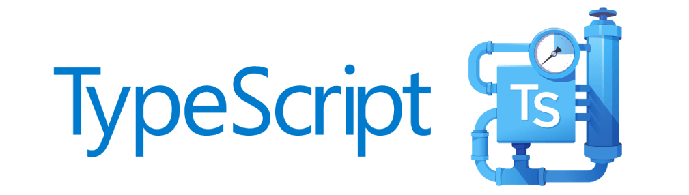

# Sobre
**Profile** é um "currículo online" pessoal para agregar meus principais feitos e projetos na área de Tecnologia da Informação. Você pode acessá-la através desse [link](https://cledersonbc.github.io/profile/).

# Tecnologias
O projeto foi desenvolvido em:
* **HTML5**, para a representação visual das informações e estruturação básica dos elementos da página;
* **CSS3**, para a estilização de componentes específicos e
* **TypeScript**, para a programação da página como um todo e aplicação da lógica de apresentação.

## Desenvolvimento com TypeScript

A aplicação feita em TS está toda modularizada, arquiteturalmente baseada no modelo MVC (*model-view-controller*).

### :page_with_curl: Model
Neste módulo há interfaces que definem os atributos obrigatórios e não-obrigatórios dos modelos de dados.

Um modelo de dados é a abstração de alguma entidade da página que contém características, como um Projeto, um Curso etc. Um Projeto, por exemplo, é representado por uma entidade contendo nome, descrição, imagem e uma URL.

### :bar_chart: View
Neste módulo há classes que definem a representação visual, por meio de *templates*, dos modelos de dados.

Como toda classe exibe um comportamento semelhante — de receber um modelo de dados e representá-lo, a herança foi utilizada para reutilização e redução de código.

### :wrench: Controller
Neste módulo há classes que combinam modelos com sua respectiva representação visual.

Aplicou-se o mesmo critério de herança neste módulo. Além da herança, estes *controllers* foram preparados para trabalharem com listas de modelos homogêneos, que é uma abordagem que facilita adicionar novos modelos na visualização final.

### :books: Data
Neste módulo há classes que implementam os modelos de dados em si. Em outras palavras, são listas contendo os dados que serão utilizados no preenchimento dos modelos para os demais módulos funcionarem.

A estratégia dessa abordagem é desacoplar o modelo de dados (abstrato) de sua implementação (contcreta). Dessa forma, basta adicionar um novo objeto à lista, em *data*, que automaticamente ele será manipulado pelos outros módulos e representado (claro, após tudo isso ser transpilado).

# :gear: Execução
É necessário instalar todas as dependências do projeto com `npm install` e transpilá-lo com a ajuda do `grunt`. O TypeScript será minificado e transpilado para JavaScript.

O NPM é um gerenciador de pacotes para JavaScript. Cada pacote contém bibliotecas de códigos que foram utilizadas no projeto, feitas por terceiros. Veja cada uma no arquivo `package.json`.

O Grunt é um executor de tarefas (conhecido como *task runner*, em inglês).

Basicamente é uma automatização para execução de comandos do ciclo de vida do nosso projeto (transpilar, minificar, testar etc.).

# Futuro
Novas *features* serão implementadas, como a internacionalização do projeto para que seja acessível a estrangeiros, que hoje predominam no quesito interação com meus projetos.
* [ ] Internacionalização do Projeto
* [ ] Substituir GOHORSE por testes unitários